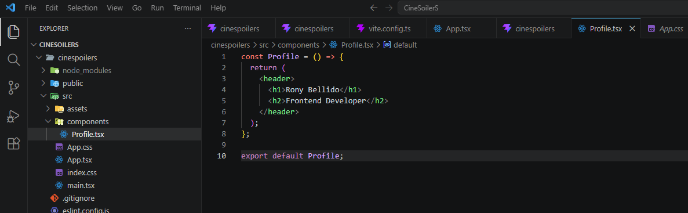
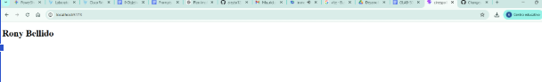

# Laboratorio 9

## Integrantes

- Rony Bellido
- Mauricio Rojas
- Xiomara Garcia

## Capturas
- Mauricio Rojas 

- Bellido Rony

## 📸 Capturas del proceso
## 👨‍💻 Autor

**Garcia Silva Xiomara**

### 1. Proyecto creado

### 2. Proyecto corriendo en el navegador

### 3. Reemplazando "Get Started" por nombre propio

### 4. Nombre y apellido en pantalla

### 5. Componente Profile — primeros pasos con componentes React

---
